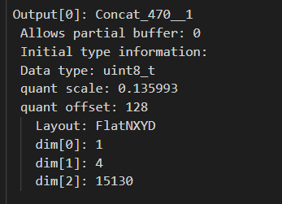
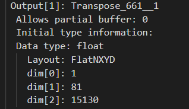

# R34SSD 1200*1200 -- Host ABP NMS Library
---

## Details regarding the Library
---

1. The output names and shapes of the model after running on AIC H/W are:
   * Transpose_661_out_0_0.raw --> Softmax Path [1, 81, 15130]
   * Concat_470_out_0_0.raw --> Box Path [1, 4, 15130]

2. The CMakeLists.txt when built will generate the shared library [libnms.so].

3. To build the Shared Library, This will create shared library in build folder, follow below steps:

````
   mkdir build
   cd build
   cmake ..
   make -j10
````

4. The file "generateSSDAnchors.py" will generate the "priors.bin" file required for ABP processing.
   * We have generated the precompiled priors and kept inside ./data/priors.bin

5. The shared library can be integrated with loadGen and now can be used for mAP and performance calculation.

6. All the values required for ABP NMS computations are set to default using config parameter and are set in AnchorBoxProcessing constructor.
   * All the parameters like Score Threshold, NMS Threshold, Scale and Offset for INT8 computation can be configured via AnchorBoxProcessing() contructor.

7. Sample way of configuring the Constructor is shown below:
   * The right scale and offset values can be found using networkDesc reading command given in step 13.

````
   AnchorBoxConfig tempConfig;
   tempConfig.classT = 0.05;
   tempConfig.nmsT = 0.5;

   tempConfig.locOffset = 0.0f;
   tempConfig.locScale = 1.0f;
   tempConfig.confOffset = 0.0f;
   tempConfig.confScale = 1.0f;

   AnchorBoxProc nwOutputLayer(tempConfig);
````

8. The Tensor ordering for AnchorBoxProcessing() should be:
   * First should be LocationTensors. [1, 4, 15130]
   * Next should be ConfidenceTensors. [1, 81, 15130]

9. Sample way of calling the AnchorBoxProcessing function with right ordering is:

````
float batchIdx = 0;

uint8_t* dataLoc = new uint8_t[1 * NUM_COORDINATES * TOTAL_NUM_BOXES];

float* dataConf = new float[1 * NUM_CLASSES * TOTAL_NUM_BOXES];

anchor::uTensor tLoc = anchor::uTensor({ "tLoc",
                                 {1, 4, 15130},
                                 dataLoc });
anchor::fTensor tConf = anchor::fTensor({ "tConf",
                                 {1, 81, 15130},
                                 dataConf });
std::vector<std::vector<float>> results(0,std::vector<float>(NUM_COORDINATES+2,0));

nwOutputLayer.anchorBoxProcessingUint8FloatPerBatch(tLoc, tConf, results, batchIdx);
````

10. Sample way of calling the AnchorBoxProcessing function with threads:

````
float batchIdx = 0;

anchor::uTensor tLoc1 = anchor::uTensor({ "tLoc",
                                 {1, 4, 15130},
                                 dataLoc });
anchor::uTensor tConf1 = anchor::fTensor({ "tConf",
                                 {1, 81, 15130},
                                 dataConf });
anchor::uTensor tLoc2 = anchor::uTensor({ "tLoc",
                                 {1, 4, 15130},
                                 dataLoc });
anchor::uTensor tConf2 = anchor::fTensor({ "tConf",
                                 {1, 81, 15130},
                                 dataConf });
std::vector<std::vector<float>> results1(0,std::vector<float>(NUM_COORDINATES+2,0));
std::vector<std::vector<float>> results2(0,std::vector<float>(NUM_COORDINATES+2,0));

std::thread th1(&AnchorBoxProc::anchorBoxProcessingUint8FloatPerBatch, &nwOutputLayer, std::ref(tLoc1), std::ref(tConf1), std::ref(results1), batchIdx);
std::thread th2(&AnchorBoxProc::anchorBoxProcessingUint8FloatPerBatch, &nwOutputLayer, std::ref(tLoc2), std::ref(tConf2), std::ref(results2), batchIdx);
th1.join();
th2.join();
````


12. Description of different functions present in AnchorBoxSSD.hpp

````
AnchorBoxProc::anchorBoxProcessingUint8FloatPerBatch()
<!-- Loc output from model is in uint8_t and Conf output from model in float-->

AnchorBoxProc::anchorBoxProcessingFloatPerBatch()
<!-- Use above function if both Loc and Conf outputs from model are in float-->

AnchorBoxProc::anchorBoxProcessingUint8PerBatch()
<!-- Use above function if both Loc and Conf outputs from model are in uint8_t-->

AnchorBoxProc::anchorBoxProcessingInt8PerBatch()
<!-- Use above function if both Loc and Conf outputs from model are in int8_t-->

````

13. Steps to generate Network Desc are:

````
   /opt/qti-aic/exec/qaic-exec -m=./resnet34-ssd1200-no-tranpose-with-softmax.onnx -aic-hw -aic-hw-version=2.0    -input-list-file=./file-list.txt -load-prodile=./profile.yaml -quantization-schema=symmetric_with_uint8 -quantization-precision=Int8 -aic-minimize-host-traffic -aic-compile-only-test -aic-binary-dir=./Binaries
````

   * The above command generates all the required network binaries along with networkdesc in "Binaries" folder.
   * To convert the networkdesc bin to txt file, run the below command:

````
AIC.1.2.32/Compiler.AIC.1.2.32/release/bin/qaic_nwdesc_reader_test networkdesc.bin > ./network_desc.txt
````
   * Now, network_desc.txt would have all the information regarding pre, post, scale and offset values.

14. Scale and offset for two outputs nodes [Transpose_661 and Concat_470__1] can be found in network_desc.txt.
    See below snapshot:

    

    

